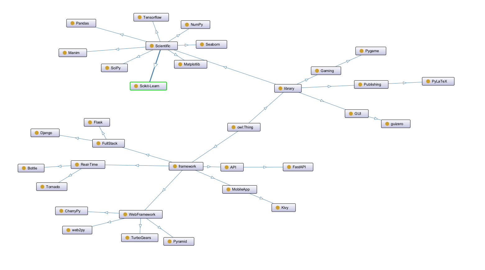

This is my self learning and practices on Python

# Python Eco-System (updated from my knowledge)

# Packaged Learning and Courses

## Manim - Python library for technology animation

[Manim Learning Mindmap](manim/Manim.md)

## Learn Python GUI

[GUI_Python Readme](GUI_Python/README.md)

## Scientific Programming with Python

[Sci-Prog](Sci_Prog/README.md)

---

# Python Programming Tools

- [Real Python Tutorial](https://realpython.com/)
- http://docs.python.org/py3k/ has documentation and tutorials for the Python 3 programming language.
- [PYnative](https://pynative.com/): Learn Python with Tutorials, Exercises, and Quizzes
- Tkinter can be used to build graphical programs
    - [Tkinter reference](http://www.pythonware.com/library/an-introduction-to-tkinter.htm) by Fred Lundh
    - [Tkinter documentation](http://infohost.nmt.edu/tcc/help/pubs/tkinter/) from the New Mexico Tech Computer Center

---

Welcome to add your comments in [Discussion Board](https://github.com/yasenstar/python/discussions), enjoy.