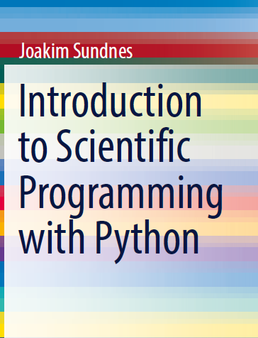

# Learn Scientific Programming with Python

Thanks for the nice book:

Following is the book structure:

Check the source code in this folder, the course is to be published in Udemy soon.

Enjoy learning!