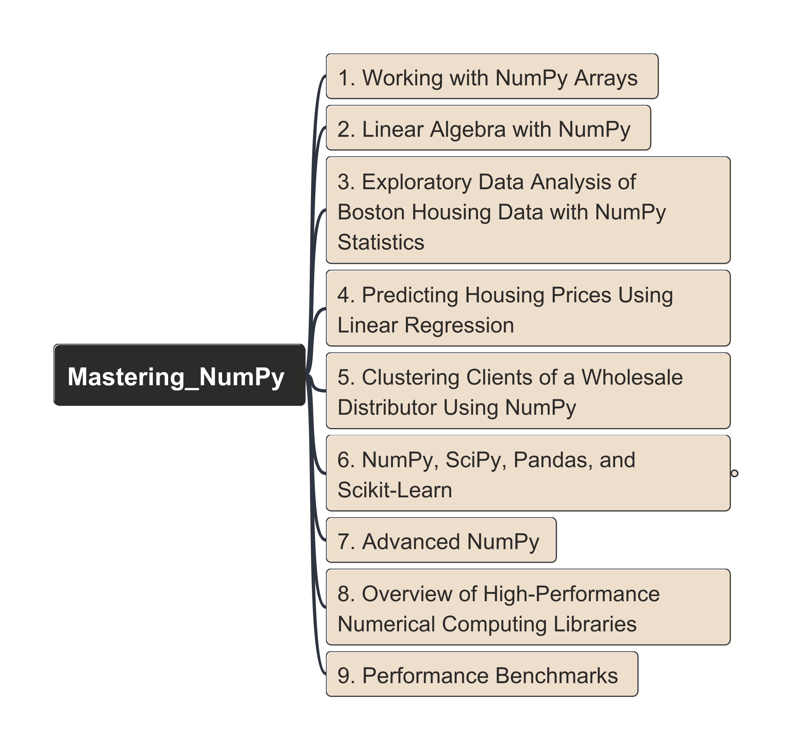

# Mastering Numerical Computing with NumPy

> [!IMPORTANT]
> NumPy = Numerical Python

- [Mastering Numerical Computing with NumPy](#mastering-numerical-computing-with-numpy)
  - [Contents](#contents)
  - [Go to Chapters Directly](#go-to-chapters-directly)
  - [List of Reference Links for Typing Math Symbol using LaTeX Syntax](#list-of-reference-links-for-typing-math-symbol-using-latex-syntax)

## Contents

<!-- <map name="Mastering_NumPy_Contents" id="Mastering_NumPy_Contents_NaviMap">
<area shape="rect" coords="334,50,669,89" href="./1_working-with-numpy-arrays/README.md" alt="chapter1" title="1_working-with-numpy-array" />
</map>
 -->

## Go to Chapters Directly

| Chapter | Knowledge Points | Demo Code (NoteBook) |
| --- | --- | --- |
| 1. Working with NumPy Arrays | [README](./1_working-with-numpy-arrays/README.md) | [Codes_1.4](./1_working-with-numpy-arrays/ch01_1.4.ipynb), [Codes_1.5](./1_working-with-numpy-arrays/ch01_1.5.ipynb), [Codes_1.6](./1_working-with-numpy-arrays/ch01_1.6.ipynb) |

## List of Reference Links for Typing Math Symbol using LaTeX Syntax

- [Cheat Sheet: Adding Math Notation to Markdown](https://www.upyesp.org/posts/makrdown-vscode-math-notation/)
- [Math Expressions in Markdown: Complete LaTeX and MathJax Guide](https://blog.markdowntools.com/posts/markdown-math-expressions-complete-guide) -- source: MarkdownTools
- [Summation in LaTeX Explained with Limits and Multiple Conditions](https://www.physicsread.com/latex-summation/) -- source: Physics Read
- [Complete Guide of Lean LaTeX](https://www.overleaf.com/learn) -- source: Overleaf, check from `Mathematics` sections
- [Math model summation text top and bottom](https://tex.stackexchange.com/questions/328538/math-mode-summation-text-top-and-bottom) -- source: TEX in StackExchange
- [How to get dots in Latex \ldots, \cdots, \vdots and \ddots](https://www.math-linux.com/latex/faq/latex-faq/article/how-to-get-dots-in-latex-ldots-cdots-vdots-and-ddots) -- source: Math-Linux.com
- [Writing mathematical expressions](https://docs.github.com/en/get-started/writing-on-github/working-with-advanced-formatting/writing-mathematical-expressions) -- source: GitHub Docs
- [How to show math equations in general github's markdown (not github's blog)](https://stackoverflow.com/questions/11256433/how-to-show-math-equations-in-general-githubs-markdownnot-githubs-blog) -- source: stackoverflow
- [LaTeX/Mathematics](https://en.wikibooks.org/wiki/LaTeX/Mathematics) -- source: WikiBooks

---

Last updated at: 1/4/2026, 8:32:27 PM 