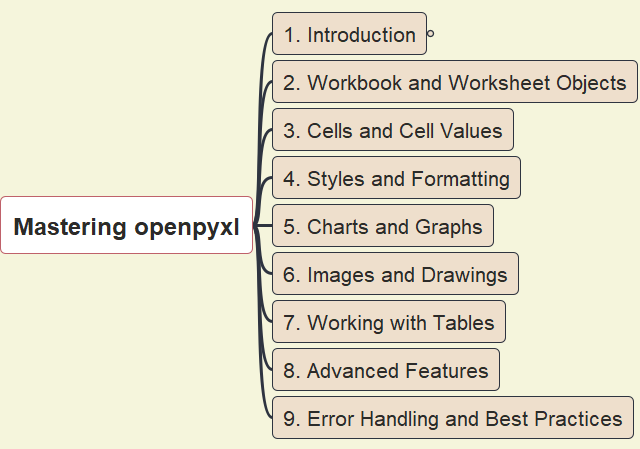

# Mastering Python's `openpyxl`

- [Mastering Python's `openpyxl`](#mastering-pythons-openpyxl)
  - [Purpose](#purpose)
  - [High-Level Structure](#high-level-structure)
  - [Contents](#contents)
  - [Resources about `openpyxl`](#resources-about-openpyxl)

## Purpose

This course is mainly based on the "Technical Manual" published at https://manuals.muthu.co, and combining several other relevant samples, aiming to provide a **one-stop library** for anyone interested to learn `openpyxl` - Python library - for Microsoft Excel.

## High-Level Structure

You may open the [mindmap file](./Mastering_openpyxl.mm) within the open source tool - FreePlane.

Read the detail structure from the [exported markdown format](./Mastering_openpyxl.md)

## Contents

1. [Introduction](./1_introduction/)
2. [Workbook and Worksheet Objects](./2_workbook_and_worksheet_objects/)
3. [Cells and Cell Values](./3_cells_and_cell_values/)
4. [Styles and Formatting](./4_styles_and_formatting/)
5. [Charts and Graphs](./5_charts_and_graphs/)
6. [Images and Drawings](./6_images_and_drawings/)
7. [Working with Tables](./7_working_with_tables/)
8. [Advanced Features](./8_advanced_features/)
9. [Error Handling and Best Practices](./9_error_heandling/)

## Resources about `openpyxl`

- [OpenPyXL page in gitpages](https://openpyxl.pages.heptapod.net/openpyxl/)
  - [source code](https://foss.heptapod.net/openpyxl/openpyxl)
- [openpyxl 3.1.3 documentation](https://openpyxl.readthedocs.io/en/stable/)
- [Technical Manuals about openpyxl](https://manuals.muthu.co/posts/python-modules/openpyxl.html)
- [A Guide on openpyxl, by Pedro Pregueiro](https://realpython.com/openpyxl-excel-spreadsheets-python/)

---

Last Updated at 12/27/2025, 3:34:21 PM 